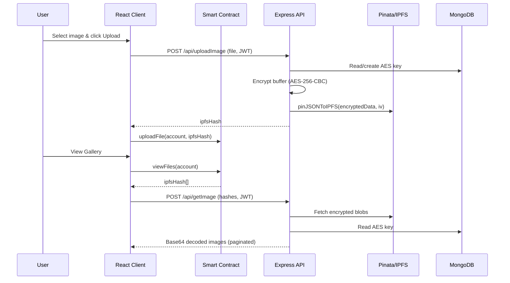

# IPFS– Encrypted Web3 Image Vault

> A non-custodial React + Web3 experience for encrypting personal images, persisting them on IPFS through Pinata, and gating access with smart-contract ownership plus JWT-based API auth.

## Table of Contents
- Overview
- Features
- Architecture
- Repository Layout
- Prerequisites
- Backend Setup
- Frontend Setup
- Environment Variables
- Available Scripts
- API Reference
- Smart-Contract Integration
- Usage Guide
- Troubleshooting & Next Steps

## Overview
Project K pairs a Vite/React client with an Express/MongoDB API to let users connect a wallet, sign a challenge, and obtain a JWT that unlocks encrypted image storage. Files are encrypted server-side with AES-256 before being pushed to Pinata/IPFS; only the requesting user’s encryption key (kept in MongoDB) can decrypt the payload when it is fetched back through the API.

## Features
- **Wallet-gated onboarding** – Users sign a custom message through MetaMask/ethers to mint a JWT for API access.
- **End-to-end encryption** – Images are encrypted with per-user AES-256 keys generated on first upload and stored as buffers in MongoDB.
- **IPFS persistence** – The encrypted payloads plus IVs are pinned to Pinata, returning resilient IPFS hashes.
- **Smart-contract backed ACL** – The React client records every uploaded file hash on-chain (see `connectWallet.js`), and later queries the contract for the hashes it may access.
- **Token-authenticated REST API** – `x-access-token` headers protect upload/retrieval routes via JWT verification middleware.
- **Responsive UI** – Tailwind-powered Wallet, Upload, and Gallery screens with toasts, pagination, and state handled through a lightweight React context provider.

## Architecture
```mermaid
flowchart LR
	 A[User Wallet<br/>MetaMask] -->|Sign message & select account| B[React + Vite Client]
	 B -->|POST /api/authentication<br/>signature| C[Express API]
	 C -->|JWT| B
	 B -->|Upload file| B1[Pinata/IPFS]
	 B -->|Call uploadFile()| SC[Smart Contract]
	 C -->|Encrypt + pin hash| B1
	 B -->|Request images + pagination| C
	 C -->|Decrypt with per-user AES key| DB[(MongoDB)]
	 C -->|Base64 payloads| B
```

### Upload & Retrieval Sequence


## Repository Layout
```
project-k/
├─ backend/server
│  ├─ controllers/ (auth, upload, retrieval)
│  ├─ middleware/ (JWT guard, multer in-memory storage)
│  ├─ utils/ (AES encrypt/decrypt, key generation)
│  ├─ routes/ (/api/authentication, /api/uploadImage, /api/getImage)
│  └─ index.js (Express bootstrap + Mongo connect)
└─ frontend/client
	├─ src/
	│  ├─ components/ (Navbar, UploadImages, GetImage, etc.)
	│  ├─ contexts/ (Web3 provider + hooks)
	│  ├─ pages/ (Wallet, Home)
	│  ├─ routes/ (React Router config)
	│  └─ utils/connectWallet.js (ethers v6 integration)
	└─ vite/tailwind configs
```

## Prerequisites
- Node.js 18+ and npm (or pnpm/yarn) installed locally.
- A MetaMask-compatible browser wallet with access to the deployed contract network.
- Pinata account credentials plus a MongoDB Atlas (or self-hosted) connection string.
- Optional: `make` or task runner for concurrent start scripts.

## Backend Setup (`backend/server`)
1. Copy `.env` and replace secrets with your own values (see table below). Never commit real credentials.
2. Install dependencies:
	```bash
	cd backend/server
	npm install
	```
3. Start the API:
	```bash
	npm start
	```
	The server connects to MongoDB before listening on `PORT` (defaults to `3000`).

## Frontend Setup (`frontend/client`)
1. Create `frontend/client/.env` and point `BACKEND_URL` to your API origin.
2. Install dependencies:
	```bash
	cd frontend/client
	npm install
	```
3. Launch the Vite dev server:
	```bash
	npm run dev
	```
4. Open the provided local URL, connect your wallet, and follow the on-screen CTAs.

## Environment Variables

| Location | Variable | Purpose |
| --- | --- | --- |
| `backend/server/.env` | `MONGO_URL` | Connection string for MongoDB (Atlas SRV or local). |
|  | `PORT` | Optional server port override. |
|  | `JWT_SECRETKEY` | Secret used to mint/verify JWTs in `authenticateToken`. |
|  | `PINATA_APIKEY` | Pinata API key for `pinJSONToIPFS`. |
|  | `PINATA_SECRETKEY` | Matching Pinata secret. |
| `frontend/client/.env` | `BACKEND_URL` | Base URL consumed by the React client (use trailing slash). |

> Tip: keep `.env.example` files with placeholder values and add `.env` to `.gitignore` so credentials never leak.

## Available Scripts

| Directory | Command | Description |
| --- | --- | --- |
| `frontend/client` | `npm run dev` | Start Vite with hot module reload. |
|  | `npm run build` | Bundle the React app for production. |
|  | `npm run preview` | Preview the production build locally. |
|  | `npm run lint` | Run ESLint against the entire client. |
| `backend/server` | `npm start` | Boot the Express API (uses `index.js`). |

## API Reference

| Method & Path | Auth | Body | Description |
| --- | --- | --- | --- |
| `POST /api/authentication?address=<wallet>` | None | `{ "signature": string }` | Verifies the signed message (`"Welcome to Project k"`), creates user if needed, returns `{ token }`. |
| `POST /api/uploadImage` | `x-access-token` | `multipart/form-data` field `file` | Encrypts file bytes, pins `{ encryptedData, iv }` to Pinata, and returns `{ ipfsHash }`. |
| `POST /api/getImage?page=N&limit=M` | `x-access-token` | `Array<string>` of IPFS hashes | Fetches encrypted blobs, decrypts with the user’s AES key, and responds with `depcryptedImageArr` (base64 strings). |

All protected routes rely on `authenticateToken`, so expired/invalid tokens lead to `500` with the current implementation—refresh your token by reconnecting the wallet.

## Smart-Contract Integration
- The client expects an ethers-compatible contract at `0xF50D5C84FAb512778fe7A1514c9ec491BDB1AfCA` exposing `uploadFile(address, string)` and `viewFiles(address)` (see `src/utils/connectWallet.js`).
- Update `contractAbi.json` and the address inside `connectWallet.js` if you redeploy.
- Transactions are surfaced through `react-hot-toast` promises so users can track pending/failed states.

## Usage Guide
1. **Connect Wallet** – On the landing page (`/`), click **Connect Wallet**. Sign the prompt to obtain the JWT; the app navigates to `/home` and stores `token` + `selectedAccount` in context/localStorage.
2. **Upload Images** – Choose a `.jpg/.jpeg/.png`. The client sends it to `/api/uploadImage`, receives an `ipfsHash`, and records it on-chain via `contractInstance.uploadFile`.
3. **View Images** – The gallery fetches the hash list from the contract, requests decrypted blobs from `/api/getImage`, and displays them in a horizontally scrollable strip with pagination controls.
4. **Pagination** – `imagePerPage` defaults to `2` inside `GetImage.jsx`; adjust this state if you want denser galleries.

## Troubleshooting & Next Steps
- **MetaMask not found** – `connectWallet` throws if `window.ethereum` is undefined. Ensure MetaMask is installed or inject a custom provider before loading the app.
- **JWT errors** – Remove stale tokens (`localStorage.removeItem("token")`) and reconnect to refresh your session.
- **Pinata issues** – Confirm API credentials and that your plan supports `pinJSONToIPFS`. Consider swapping in another IPFS pinning service if needed.
- **Recommended enhancements**:
  1. Add automated tests for controllers/middleware.
  2. Expose dynamic backend base URLs to the client (consume `BACKEND_URL` in helper utilities instead of hard-coded strings).
  3. Display on-chain transaction history per file, including timestamps and IPFS links for auditability.

Project K now ships with end-to-end documentation—feel free to expand sections as the smart contract or API evolves.
